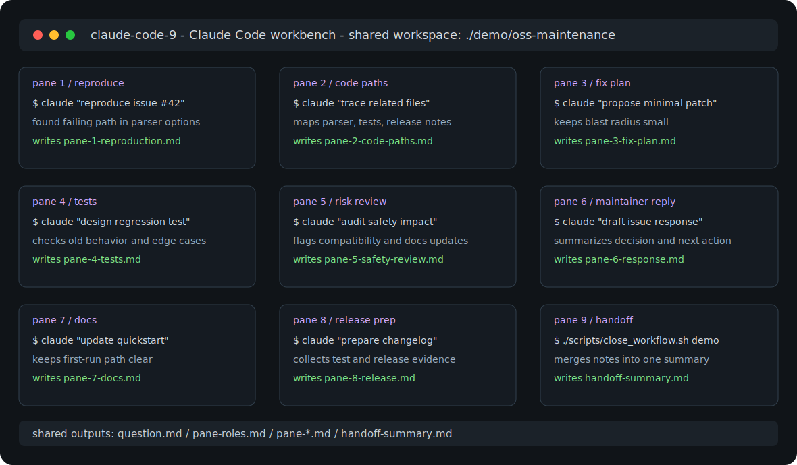

# Claude Code Workbench

[](https://github.com/goonobu-dot/claude-code-workbench/actions/workflows/ci.yml)
[](https://github.com/goonobu-dot/claude-code-workbench/releases)
[](LICENSE)

A macOS/tmux workbench for running up to 9 Claude Code CLI sessions in one Terminal window.

This is a focused public version of a real local workflow: launch several Claude Code panes, point them at one shared idea folder, and use them for research, ideation, implementation planning, and comparison.

This project is not affiliated with Anthropic.



## Why This Exists

One AI-agent chat is useful. Several panes are better when you want independent angles on the same problem.

Use this workbench for:

- parallel research
- competing solution ideas
- feature planning
- review and risk checks
- collecting outputs into one shared folder
- keeping a repeatable Claude Code multi-pane setup

## Requirements

- macOS
- `tmux`
- Claude Code CLI installed as `claude` or configured with `CLAUDE_WORKBENCH_COMMAND`
- Python 3 and Pillow only if you regenerate the icon

Install tmux with Homebrew:

```bash
brew install tmux
```

## Quick Start

One-command install:

```bash
curl -fsSL https://raw.githubusercontent.com/goonobu-dot/claude-code-workbench/main/scripts/install.sh | bash
```

Then launch:

```bash
cd "$HOME/ClaudeCodeWorkbench/claude-code-workbench"
make demo
./scripts/launch_claude_tmux.sh
```

Check your local setup without starting a workbench session:

```bash
./scripts/doctor.sh
```

Run the local validation suite:

```bash
make test
```

Create a reusable maintainer workflow folder before launching panes:

```bash
./scripts/new_workflow.sh issue-triage
CLAUDE_WORKBENCH_IDEA_DIR="$HOME/ClaudeCodeWorkbench/Idea" ./scripts/launch_claude_tmux.sh
```

Start directly from a public GitHub issue or pull request URL:

```bash
./scripts/create_workflow_from_url.sh https://github.com/owner/repo/issues/123
./scripts/create_workflow_from_url.sh https://github.com/owner/repo/pull/123
```

Launch with role-specific prompts generated from `pane-roles.md`:

```bash
CLAUDE_WORKBENCH_IDEA_DIR="$HOME/ClaudeCodeWorkbench/Idea" \
CLAUDE_WORKBENCH_USE_ROLE_PROMPTS=1 \
./scripts/launch_claude_tmux.sh
```

After the panes write their notes, create a handoff summary:

```bash
./scripts/close_workflow.sh "$HOME/ClaudeCodeWorkbench/Idea"
```

Export a workflow folder for sharing:

```bash
./scripts/export_workflow.sh "$HOME/ClaudeCodeWorkbench/Idea"
```

Import a shared workflow archive:

```bash
./scripts/import_workflow.sh ./Idea-workflow-export.tar.gz
```

All panes use one shared idea folder by default:

```bash
~/ClaudeCodeWorkbench/Idea
```

Manual clone instead of the installer:

```bash
mkdir -p "$HOME/ClaudeCodeWorkbench"
git clone https://github.com/goonobu-dot/claude-code-workbench.git "$HOME/ClaudeCodeWorkbench/claude-code-workbench"
cd "$HOME/ClaudeCodeWorkbench/claude-code-workbench"
./scripts/doctor.sh
```

## Controls

The workbench uses tmux. The prefix is usually `control-b`.

- `control-b z`: zoom or unzoom the active pane
- mouse support is enabled
- each pane starts a separate Claude Code session

## Configuration

```bash
CLAUDE_WORKBENCH_PANE_COUNT=4 ./scripts/launch_claude_tmux.sh
CLAUDE_WORKBENCH_BASE="$HOME/ClaudeCodeWorkbench" ./scripts/launch_claude_tmux.sh
CLAUDE_WORKBENCH_IDEA_DIR="$HOME/ClaudeCodeWorkbench/Research" ./scripts/launch_claude_tmux.sh
CLAUDE_WORKBENCH_COMMAND="/opt/homebrew/bin/claude" ./scripts/launch_claude_tmux.sh
CLAUDE_WORKBENCH_MODEL="sonnet" ./scripts/launch_claude_tmux.sh
CLAUDE_WORKBENCH_AUTO_SUBMIT=0 ./scripts/launch_claude_tmux.sh
```

Defaults:

| Setting | Default |
| --- | --- |
| `CLAUDE_WORKBENCH_PANE_COUNT` | `9` |
| `CLAUDE_WORKBENCH_SESSION` | `claude-code-9` |
| `CLAUDE_WORKBENCH_BASE` | `~/ClaudeCodeWorkbench` |
| `CLAUDE_WORKBENCH_IDEA_DIR` | `~/ClaudeCodeWorkbench/Idea` |
| `CLAUDE_WORKBENCH_MODEL` | `sonnet` |
| `CLAUDE_WORKBENCH_EFFORT` | `low` |
| `CLAUDE_WORKBENCH_PERMISSION_MODE` | `auto` |
| `CLAUDE_WORKBENCH_AUTO_SUBMIT` | `1` |

## Build The macOS App

```bash
./scripts/build_claude_app.sh
open "$HOME/Applications/Claude Code Workbench.app"
```

The generated app opens Terminal and launches the tmux workbench. The checked-in AppleScript does not contain a personal path. By default, it expects this repository at:

```bash
~/ClaudeCodeWorkbench/claude-code-workbench
```

## Workflow Recipes

See [docs/workflows.md](docs/workflows.md) for practical ways to use the panes without creating noise.

See also:

- [docs/oss-maintainer-use-cases.md](docs/oss-maintainer-use-cases.md)
- [docs/showcase.md](docs/showcase.md)
- [docs/why.md](docs/why.md)
- [docs/one-minute-demo.md](docs/one-minute-demo.md)
- [docs/commands.md](docs/commands.md)
- [docs/architecture.md](docs/architecture.md)
- [docs/workflow-templates.md](docs/workflow-templates.md)
- [docs/workflow-sharing.md](docs/workflow-sharing.md)
- [docs/troubleshooting.md](docs/troubleshooting.md)
- [docs/faq.md](docs/faq.md)
- [SUPPORT.md](SUPPORT.md)
- [docs/publication-checklist.md](docs/publication-checklist.md)
- [docs/openai-codex-for-oss.md](docs/openai-codex-for-oss.md)
- [docs/adoption-plan.md](docs/adoption-plan.md)

Example:

- [examples/issue-triage-demo](examples/issue-triage-demo)
- [examples/pr-review-demo](examples/pr-review-demo)
- [examples/release-prep-demo](examples/release-prep-demo)
- [examples/feature-discovery-demo](examples/feature-discovery-demo)

Project operations:

- [ROADMAP.md](ROADMAP.md)
- [CHANGELOG.md](CHANGELOG.md)
- [SECURITY.md](SECURITY.md)

If you try it on a real or fictional maintainer task, share the result with the
[usage report issue template](.github/ISSUE_TEMPLATE/usage_report.yml). Reports
about confusing setup steps are as useful as reports about successful workflows.

## Safety Notes

This repository intentionally does not include local logs, `.env` files, prompt histories, Obsidian vaults, generated agent output, or app bundles.

Before publishing your own fork, run:

```bash
make test
```

## Project Status

This is an early public release. It is intentionally small: shell scripts, AppleScript launchers, generated icon assets, tests, and CI.
